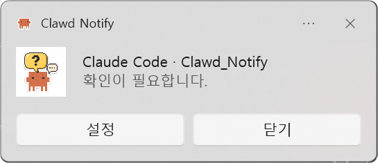
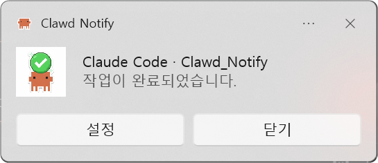
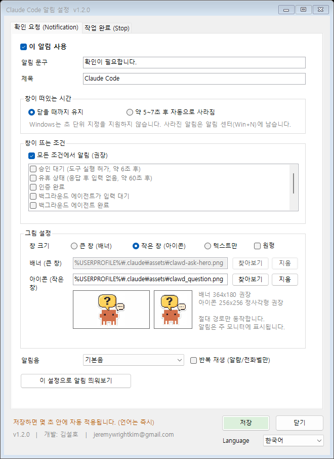

# Claude Code — Clawd 토스트 알림

**한국어** | [English](README.en.md)

Claude Code가 확인을 요청하거나 작업을 끝냈을 때 Windows 토스트 알림을 띄웁니다.

| 확인이 필요할 때 | 작업이 끝났을 때 |
|---|---|
|  |  |

제목에는 프로젝트 폴더 이름이 붙고, 알림을 클릭하면 해당 VS Code 창이 앞으로 옵니다.

| 이벤트 | 알림 | 발화 시점 |
|---|---|---|
| `PermissionRequest` | Clawd + 물음표 | 승인이 필요한 순간 **즉시** (기본 꺼짐) |
| `Notification` | Clawd + 물음표 | 승인 대기·유휴 등 (6초/60초 지연) |
| `Stop` | Clawd 만세 + 체크 | Claude가 응답을 마쳤을 때 |

### 즉시 알림 vs 지연 알림

`Notification`의 지연(승인 대기 약 6초, 유휴 약 60초)은 Claude Code에 **하드코딩되어 있어 설정으로 줄일 수 없습니다.**

바로 알림을 받으려면 `settings.bat`에서 **즉시 알림(승인 요청)** 탭을 켜세요. `PermissionRequest` 이벤트를 사용해 지연 없이 발화합니다.

두 가지를 동시에 켜면 승인 요청 시 알림이 2번 뜹니다. 하나만 켜는 것을 권장하며, 저장할 때 경고가 표시됩니다.

`PermissionRequest`는 권한 결정에 개입할 수 있는 이벤트이지만, 이 알림 스크립트는 아무것도 출력하지 않고 종료하므로 정상 승인 흐름을 방해하지 않습니다.

## 설치

`install.bat` 더블클릭. 실행 중인 Claude Code에도 몇 초 안에 자동 반영됩니다(재시작 불필요).

| 파일 | 동작 |
|---|---|
| `install.bat` | 설치 (기존 hook이 있으면 확인) |
| `settings.bat` | **설정 창 열기** |
| `uninstall.bat` | 제거 |

`install.bat -Force`로 실행하면 기존 hook을 확인 없이 덮어씁니다.

`install.bat -Language en`처럼 표시 언어(`ko` / `en`)를 지정할 수 있습니다. 생략하면 기존 설정을 유지하고, 처음 설치라면 Windows 표시 언어를 따릅니다.

## 언어 (한국어 / English)

설정 창 오른쪽 아래 **Language**에서 한국어와 English를 고를 수 있습니다. 고르는 즉시 저장되고 설정 창이 해당 언어로 다시 열립니다.

언어 설정은 다음에 모두 적용됩니다.

- 설정 창
- 알림 버튼 (설정 / 닫기 ↔ Settings / Close)
- 기본 알림 문구 (`확인이 필요합니다.` ↔ `Claude needs your attention.`, `작업이 완료되었습니다.` ↔ `Task completed.`)
- 설치·제거 메시지

기본 문구는 알림을 띄울 때 번역되므로 언어를 바꾼 뒤 다시 저장하지 않아도 됩니다. 직접 입력한 문구는 번역하지 않고 그대로 표시합니다.

언어 설정은 `%USERPROFILE%\.claude\claude-notify-config.json`에 저장됩니다.

## 적용 시점

**재시작은 필요 없습니다.** Claude Code는 `settings.json`을 감시하다가 바뀌면 실행 중인 세션에 다시 불러옵니다.

| 항목 | 적용 시점 | 이유 |
|---|---|---|
| 언어, 알림 버튼, 기본 문구 번역, 프로젝트 이름 표시, 클릭 시 창 전환 | **다음 알림부터 즉시** | 알림을 띄울 때마다 `claude-notify.ps1`이 새로 실행되며 읽음 |
| 알림 문구, 제목, 그림/창 크기, 알림음, 표시 시간, 이벤트 사용 여부, 발화 조건 | **저장 후 몇 초 안에** | `settings.json`의 hook 설정 → Claude Code가 파일 변경을 감지해 다시 불러옴 |

몇 초가 지나도 반영되지 않으면 Claude Code가 파일 변경을 놓친 것이니 재시작하세요. 오래된 Claude Code 버전은 hook을 시작할 때만 읽으므로 재시작이 필요할 수 있습니다.

## 설정 창

`settings.bat`을 실행하면 그래픽 설정 창이 열립니다. 이벤트별로 탭이 나뉘어 있습니다.



### 창이 떠있는 시간

| 선택 | 동작 |
|---|---|
| 닫을 때까지 유지 | 사용자가 닫기 전까지 화면에 남습니다 (기본값) |
| 약 5~7초 후 자동으로 사라짐 | Windows 기본 동작 |

Windows 토스트는 **초 단위 지정을 지원하지 않습니다.** 이 두 가지 모드만 존재합니다. 자동으로 사라진 알림도 알림 센터(`Win`+`N`)에는 남습니다.

### 창이 뜨는 조건

`Notification` 이벤트에만 해당합니다. 기본값은 모든 조건이며, 원하는 것만 고를 수 있습니다.

| 조건 | 발화 시점 |
|---|---|
| 승인 대기 | 도구 실행 허가를 기다릴 때 (약 6초 후) |
| 유휴 상태 | 응답 후 입력이 없을 때 (약 60초 후) |
| 인증 완료 | 로그인이 끝났을 때 |
| 백그라운드 에이전트 입력 대기 / 완료 | 서브에이전트 관련 |
| MCP 입력 폼 대기 | MCP 서버가 입력을 요청할 때 |
| 사용량 제한 후 자동 재개 | 제한이 풀려 자동으로 계속할 때 |

승인 대기는 약 6초 지연이 있어, 그 전에 승인하면 알림이 뜨지 않습니다.

`Stop`은 조건을 선택할 수 없습니다. Claude가 응답을 마칠 때마다 항상 발화합니다.

### 그림 설정 / 창 크기

창 크기를 3단계로 고를 수 있습니다.

| 선택 | 모습 | 저장되는 옵션 |
|---|---|---|
| 큰 창 (배너) | 이미지가 상단 전체 폭에 표시 | `-Hero` |
| 작은 창 (아이콘) | 좌측에 작은 아이콘 | `-Logo` (원형 체크 시 `-LogoCircle`) |
| 텍스트만 | 이미지 없음, 가장 작음 | 없음 |

Windows 토스트는 **픽셀 단위 크기 지정이 불가능**합니다. 폭은 시스템이 고정하며, 이미지 배치 방식에 따라 높이만 달라집니다.

배너와 아이콘은 **각각 따로 지정**합니다. 비율이 달라서 한 이미지를 공유하면 잘리거나 찌그러지기 때문입니다.

| 용도 | 비율 | 권장 크기 | 최소 |
|---|---|---|---|
| 배너 (큰 창) | 약 2:1 | **364×180** | — |
| 아이콘 (작은 창) | **1:1 정사각형** | **256×256** | 64×64 |

아이콘은 실제로 약 48×48로 표시되지만, 고해상도 디스플레이 대응을 위해 원본을 크게 넣는 편이 낫습니다. 원형 크롭(`-LogoCircle`)을 쓰면 모서리가 잘리므로 가장자리에 여백을 두세요.

설정 창에서 크기를 고르면 해당 입력칸만 활성화되고, 두 미리보기로 각각 확인할 수 있습니다.

경로는 **절대 경로**여야 합니다. 상대 경로나 없는 파일을 지정하면 Windows가 알림을 통째로 버립니다.

### VS Code 창 구분 / 클릭 시 창 전환

VS Code를 여러 개 띄워 놓아도 어느 창에서 온 알림인지 알 수 있습니다.

- **제목에 프로젝트 폴더 이름 표시** — 예: `Claude Code · Clawd_Notify`
- **알림을 클릭하면 해당 VS Code 창이 맨 앞으로** 나옵니다. 최소화되어 있으면 복원합니다.
- 그 창이 이미 닫혔으면 해당 폴더를 VS Code로 다시 엽니다.

동작 방식: hook이 넘겨주는 프로젝트 경로(`CLAUDE_PROJECT_DIR` 또는 stdin의 `cwd`)를 알림에 담고, 클릭하면 `clawd-focus://` 프로토콜로 `claude-notify-focus.exe`가 실행되어 **창 제목에 폴더 이름이 들어간 VS Code 창**을 찾아 앞으로 가져옵니다.

`claude-notify-focus.exe`는 설치 시 PowerShell 내장 C# 컴파일러(`Add-Type`)로 만듭니다. PowerShell 스크립트로 처리하면 콘솔 창이 잠깐 깜빡이기 때문에, 콘솔 없는 프로그램으로 만든 것입니다.

- 클릭 기능은 Claude Code를 VS Code 확장 또는 VS Code 통합 터미널에서 실행할 때만 켜집니다.
- VS Code 설정 `window.title`을 바꿔 창 제목에 폴더 이름(`${rootName}`)이 빠져 있으면 창을 찾지 못합니다.
- 폴더 이름이 같은 창이 여러 개면 그중 하나로 전환됩니다.

### 알림에서 설정 열기

알림 하단의 **설정** 버튼을 누르면 `settings.bat`과 같은 설정 창이 열립니다. 콘솔 창 없이 바로 열립니다.

### 모니터 지정

**불가능합니다.** 알림은 항상 주 모니터에 표시됩니다. Windows 토스트 API에 위치나 모니터를 지정하는 속성이 없고, 창을 그리는 주체가 Windows 셸이라 제어할 방법이 없습니다.

바꾸려면 Windows 설정 → 시스템 → 디스플레이에서 주 모니터를 변경하세요.

### 창 포커스와의 관계

VS Code나 터미널 창이 **활성 상태여도 알림은 뜹니다.** hook 발화는 창 포커스와 무관합니다.

### 그 외

- **알림 문구·제목** — 이벤트별로 다르게 지정
- **알림음** — 기본음/메시지음/메일음/알람음/무음 등. 알람·전화벨은 반복 재생 가능
- **이 알림 사용** — 체크를 풀면 해당 이벤트만 비활성화

**이 설정으로 알림 띄워보기** 버튼으로 저장 전에 결과를 확인할 수 있습니다.

## 설치되는 것

```
%USERPROFILE%\.claude\
├── settings.json                  (hooks 항목만 추가 — 기존 설정 보존)
├── claude-notify.ps1              토스트 발송 스크립트
├── claude-notify-settings.ps1     설정 UI
├── claude-notify-focus.exe        알림 클릭 시 VS Code 창 전환 (설치 시 컴파일)
├── claude-notify-config.json      표시 언어 설정
└── assets\
    ├── clawd-ask-hero.png     배너 364x180
    ├── clawd-done-hero.png    배너 364x180
    ├── clawd_question.png     아이콘 256x256
    ├── clawd_done.png         아이콘 256x256
    └── clawd.png              알림 헤더 아이콘 256x256 (배지 없음)

HKEY_CURRENT_USER\Software\Classes\clawd-focus   (알림 클릭용 프로토콜 — 제거 시 함께 삭제)
```

settings.json은 수정 전 `settings.json.<날짜>-<시각>.bak`으로 백업됩니다. `model`, `permissions`, 다른 hook 등 기존 설정은 유지됩니다.

## 요구 사항

Windows 10 이상, Windows PowerShell 5.1(Windows 기본 포함). 외부 모듈은 필요 없습니다.

## 알림이 안 뜰 때

**1. 설정을 바꾼 뒤 몇 초가 지났나요?**
hook 설정은 자동으로 다시 불러오지만 가끔 변경을 놓칠 수 있습니다. 그럴 때는 Claude Code를 재시작하세요.

**2. `Notification`은 터미널을 보고 있으면 발화하지 않습니다.**
Claude Code가 이미 화면에 표시한 내용을 중복 알리지 않기 때문입니다. 창을 다른 앱으로 전환한 뒤 테스트하세요.

**3. 수동 확인**

```powershell
powershell -ExecutionPolicy Bypass -File "$env:USERPROFILE\.claude\claude-notify.ps1" -Message "테스트"
```

이건 뜨는데 hook만 안 되면 설정 문제이고, 이것도 안 뜨면 Windows 알림 설정(집중 지원)을 확인하세요.

**4. Windows 알림 설정**
설정 → 시스템 → 알림에서 "Clawd Notify" 항목이 켜져 있는지 확인하세요.

## 개발

배포 파일은 `Install-ClawdNotify.ps1` 하나이며, 설정 UI와 이미지는 그 안에 Base64로 들어 있습니다. 설정 UI는 원본을 따로 관리합니다.

| 파일 | 설명 |
|---|---|
| `src/claude-notify-settings.ps1` | 설정 UI 원본 |
| `build.ps1` | `src/`의 원본을 `Install-ClawdNotify.ps1`에 넣음 |

설정 UI를 고친 뒤에는 반드시 빌드하세요.

```powershell
powershell -ExecutionPolicy Bypass -File build.ps1
```

알림 스크립트(`$NotifyScriptBody`)와 창 전환 프로그램(`$FocusSource`)은 `Install-ClawdNotify.ps1` 안에 평문으로 있어 바로 수정하면 됩니다.

`.ps1` 파일은 **UTF-8 BOM**으로 저장해야 합니다. BOM이 없으면 Windows PowerShell 5.1이 한글을 깨뜨립니다.

## 알아둘 점

토스트는 자체 AppUserModelId(`ClawdNotify`)로 보냅니다. Windows는 등록되지 않은 ID로 보낸 알림을 오류 없이 버리므로, 설치 시 `HKCU:\Software\Classes\AppUserModelId\ClawdNotify`에 표시 이름("Clawd Notify")과 아이콘을 등록합니다. 그래서 토스트 상단 헤더, 알림 설정 목록, 알림 센터에 "Clawd Notify"로 표시되고, 다른 PowerShell 스크립트의 알림과 따로 켜고 끌 수 있습니다. 제거 시 이 등록과 알림 설정 키(`...\Notifications\Settings\ClawdNotify`), 알림 센터에 남은 알림을 함께 지웁니다.

---

v1.2.0 | 개발: 김설호 | jeremywrightkim@gmail.com
